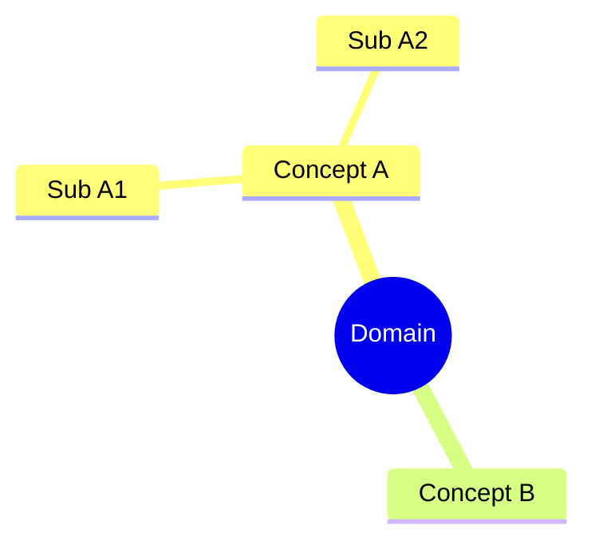
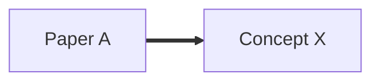

# wiki-mindmap — Generate a Mermaid diagram for a wiki domain

Use this skill to produce a visual map of a sub-domain of the wiki (or the whole wiki). Output goes to `wiki/mindmaps/<name>.md`.

## Three scopes

1. **Per-paper** — concepts and methods introduced by a single paper, arranged hierarchically.
2. **Per-domain** — all concepts + papers + methods in a research area (e.g., "market-microstructure"), showing how they interlink.
3. **Cross-domain** — bridges between two or more domains (e.g., "ML applied to LOB", "market-making across traditional and AMM paradigms").

## Three diagrams per mindmap file

Include three Mermaid diagrams in the output for a polished result:

### Diagram 1 — hierarchical concept tree (`mindmap`)
A pure concept hierarchy rooted at the domain name. Covers the taxonomy but is **not clickable** in Mermaid 10.x.



### Diagram 2 — paper → concept/method flowchart (`flowchart LR`)
**Clickable**. Arrows: `==>` (solid) for "paper introduces concept"; `-.->` (dotted) for "paper uses concept". Add `click` directives so nodes navigate to the corresponding wiki pages. Ensure **Mermaid `securityLevel: loose`** is set in `mkdocs.yml` plugin config or clicks are suppressed.



### Diagram 3 — cross-cutting themes (`flowchart TD`)
Identifies patterns that span multiple papers (e.g., "tick-size regime predicts signal strength", "accuracy ≠ tradability"). Each theme node connects to the papers that confirm or exemplify it. Also clickable.

## Frontmatter for the mindmap page

```yaml
---
title: "<Domain> Mindmap"
type: mindmap
created: <YYYY-MM-DD>
updated: <YYYY-MM-DD>
scope: per-paper | per-domain | cross-domain
domain: <slug>
papers_covered: <N>
tags: [mindmap, ...]
related: [...]
---
```

## JSON triples block (bonus)

After the three diagrams, include a small JSON block of `{source, relation, target}` triples so the mindmap is machine-readable for future graph builds. Example:

```json
[
  {"source": "papers/foo", "relation": "introduces", "target": "concepts/bar"},
  {"source": "papers/foo", "relation": "extends", "target": "methods/baz"}
]
```

## Rendering checks

- Run `python scripts/sync_wiki_to_mkdocs.py && cd site && mkdocs build` locally after creating the mindmap; the build output should show "Page 'X Mindmap': found N diagrams, adding scripts".
- Open `http://127.0.0.1:8000/mindmaps/<slug>/` after `mkdocs serve` to verify the diagrams render and `click` directives fire. If clicks don't work, check `securityLevel: loose` in `mkdocs.yml`.

## Naming

- Per-domain: `wiki/mindmaps/<domain-slug>.md` (e.g., `market-microstructure.md`).
- Per-paper: `wiki/mindmaps/paper-<slug>.md`.
- Cross-domain: `wiki/mindmaps/<domain1>-meets-<domain2>.md`.

## Target node count per diagram

- Mindmap (hierarchical): up to ~20 concepts before it gets cramped.
- Flowchart (paper → concept): up to ~25 nodes (~10 papers + ~15 concepts/methods).
- Themes: 4–6 themes, each with 2–5 confirming papers.

If a domain exceeds these thresholds, split into multiple mindmap files rather than overloading one.
