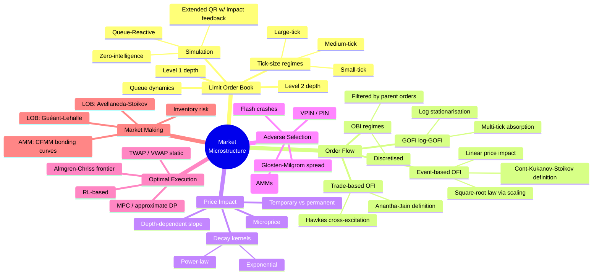

# Market Microstructure — Mindmap

Visual overview of the microstructure cluster in this wiki: **10 papers**, **7 core concepts**, **4 methods**, and the cross-cutting themes that link them.

---

## 1. Concept mindmap (hierarchical)

The five-minute mental model of the domain, rooted at *market microstructure*.



---

## 2. Paper → concept map (clickable flowchart)

Typed relationships between the 10 wiki'd papers and the concepts/methods they contribute to.
**Click any node to jump to its page.** Arrows:

- **solid** = paper introduces or centrally defines
- **dotted** = paper uses / applies / extends

```mermaid
flowchart LR
    %% Papers (left cluster)
    subgraph PAPERS["Papers"]
        CKS["Cont-Kukanov-Stoikov 2010<br/>Price Impact of<br/>Order Book Events"]
        GOFI["Su et al. 2021<br/>Generalised OFI<br/>(CSI 500)"]
        DLOB["Briola et al. 2024<br/>Deep LOB Forecasting<br/>(LOBFrame)"]
        HFOFI["Anantha-Jain 2024<br/>Hawkes OFI Forecast"]
        FILT["Anantha-Jain-Maiti 2025<br/>Order-Flow Filtration"]
        CRYPTO["Bieganowski-Slepaczuk 2026<br/>Explainable Crypto<br/>Microstructure"]
        RGAP["Noble-Rosenbaum-Souilmi 2026<br/>Reality Gap<br/>LOB Simulation"]
        MPC["McAuliffe et al. 2026<br/>MPC for Trade Execution"]
        CFMM["Risk-Tung-Wang 2026<br/>CFMM Liquidity<br/>Provision Pricing"]
        TX["Vaswani et al. 2017<br/>Attention Is All You Need"]
    end

    %% Concepts (middle cluster)
    subgraph CONCEPTS["Concepts"]
        OFI[Order Flow<br/>Imbalance]
        PI[Price Impact]
        LOB[Limit Order Book]
        AS[Adverse Selection]
        OE[Optimal Execution]
        MM[Market Making]
        TF[Transformer<br/>Architecture]
    end

    %% Methods (right cluster)
    subgraph METHODS["Methods"]
        HAWKES[Hawkes Process]
        QR[Queue-Reactive Model]
        SHAP[SHAP Values]
        MHA[Multi-Head Attention]
    end

    %% Solid = introduces / centrally defines
    CKS ==> OFI
    CKS ==> PI
    GOFI ==> OFI
    HFOFI ==> HAWKES
    CRYPTO ==> SHAP
    RGAP ==> QR
    MPC ==> OE
    CFMM ==> MM
    TX ==> TF
    TX ==> MHA

    %% Dotted = uses / applies / extends
    GOFI -.-> PI
    DLOB -.-> LOB
    DLOB -.-> TF
    HFOFI -.-> OFI
    FILT -.-> OFI
    FILT -.-> HAWKES
    FILT -.-> AS
    CRYPTO -.-> OFI
    CRYPTO -.-> AS
    CRYPTO -.-> LOB
    RGAP -.-> LOB
    RGAP -.-> PI
    RGAP -.-> OFI
    MPC -.-> PI
    CFMM -.-> MM
    CFMM -.-> AS

    %% Clickable nodes
    click CKS "../../papers/price-impact-order-book-events/" "Cont-Kukanov-Stoikov"
    click GOFI "../../papers/price-impact-generalized-ofi/" "Generalised OFI"
    click DLOB "../../papers/deep-lob-forecasting/" "Deep LOB Forecasting"
    click HFOFI "../../papers/forecasting-high-frequency-ofi/" "Hawkes OFI forecast"
    click FILT "../../papers/order-flow-filtration/" "Order-Flow Filtration"
    click CRYPTO "../../papers/explainable-crypto-microstructure/" "Explainable Crypto Microstructure"
    click RGAP "../../papers/reality-gap-lob-simulation/" "Reality Gap LOB Simulation"
    click MPC "../../papers/mpc-trade-execution/" "MPC for Trade Execution"
    click CFMM "../../papers/cfmm-liquidity-provision-pricing/" "CFMM Liquidity Provision Pricing"
    click TX "../../papers/attention-is-all-you-need/" "Attention Is All You Need"
    click OFI "../../concepts/order-flow-imbalance/" "Order Flow Imbalance"
    click PI "../../concepts/price-impact/" "Price Impact"
    click LOB "../../concepts/limit-order-book/" "Limit Order Book"
    click AS "../../concepts/adverse-selection/" "Adverse Selection"
    click OE "../../concepts/optimal-execution/" "Optimal Execution"
    click MM "../../concepts/market-making/" "Market Making"
    click TF "../../concepts/transformer-architecture/" "Transformer Architecture"
    click HAWKES "../../methods/hawkes-process/" "Hawkes Process"
    click QR "../../methods/queue-reactive-model/" "Queue-Reactive Model"
    click SHAP "../../methods/shap-values/" "SHAP Values"
    click MHA "../../methods/multi-head-attention/" "Multi-Head Attention"

    %% styling
    classDef paper fill:#fff3cd,stroke:#856404,color:#000,cursor:pointer
    classDef concept fill:#d1ecf1,stroke:#0c5460,color:#000,cursor:pointer
    classDef method fill:#d4edda,stroke:#155724,color:#000,cursor:pointer
    class CKS,GOFI,DLOB,HFOFI,FILT,CRYPTO,RGAP,MPC,CFMM,TX paper
    class OFI,PI,LOB,AS,OE,MM,TF concept
    class HAWKES,QR,SHAP,MHA method
```



---

## 3. Cross-cutting themes

Threads that link multiple papers at a conceptual level:

```mermaid
flowchart TD
    T1["<b>Tick-size regime</b><br/>predicts signal strength"]
    T2["<b>Two OFI definitions</b><br/>event-based vs trade-based"]
    T3["<b>Accuracy ≠ tradability</b><br/>execution gap"]
    T4["<b>Adverse selection</b><br/>as universal drag"]
    T5["<b>Simulator fidelity</b><br/>matters for backtests"]

    T1 --> DLOB["Briola 2024:<br/>large-tick most forecastable"]
    T1 --> CRYPTO["Bieganowski 2026:<br/>tick-size modulates OBI SHAP"]
    T1 --> RGAP["Noble 2026:<br/>method scoped to large-tick"]

    T2 --> CKS["CKS 2010:<br/>event-based OFI on NYSE"]
    T2 --> HFOFI["Anantha-Jain 2024:<br/>trade-based OFI on NSE"]

    T3 --> DLOB2["Briola 2024:<br/>operational metric"]
    T3 --> CRYPTO2["Bieganowski 2026:<br/>taker backtest vs buy-and-hold"]
    T3 --> MPC2["McAuliffe 2026:<br/>schedule shortfall and slippage"]

    T4 --> CRYPTO3["Bieganowski 2026:<br/>flash-crash taker collapse"]
    T4 --> FILT2["Filtration 2025:<br/>parent-order filter"]
    T4 --> CFMM2["CFMM 2026:<br/>Loss-Versus-Rebalancing"]

    T5 --> RGAP2["Noble 2026:<br/>impact feedback kernel"]
    T5 --> MPC3["McAuliffe 2026:<br/>L3 simulator"]

    click DLOB "../../papers/deep-lob-forecasting/" "Deep LOB Forecasting"
    click CRYPTO "../../papers/explainable-crypto-microstructure/" "Explainable Crypto Microstructure"
    click CRYPTO2 "../../papers/explainable-crypto-microstructure/" "Explainable Crypto Microstructure"
    click CRYPTO3 "../../papers/explainable-crypto-microstructure/" "Explainable Crypto Microstructure"
    click RGAP "../../papers/reality-gap-lob-simulation/" "Reality Gap LOB Simulation"
    click RGAP2 "../../papers/reality-gap-lob-simulation/" "Reality Gap LOB Simulation"
    click CKS "../../papers/price-impact-order-book-events/" "Cont-Kukanov-Stoikov"
    click HFOFI "../../papers/forecasting-high-frequency-ofi/" "Hawkes OFI forecast"
    click DLOB2 "../../papers/deep-lob-forecasting/" "Deep LOB Forecasting"
    click MPC2 "../../papers/mpc-trade-execution/" "MPC for Trade Execution"
    click MPC3 "../../papers/mpc-trade-execution/" "MPC for Trade Execution"
    click FILT2 "../../papers/order-flow-filtration/" "Order-Flow Filtration"
    click CFMM2 "../../papers/cfmm-liquidity-provision-pricing/" "CFMM Liquidity Provision Pricing"

    classDef theme fill:#f8d7da,stroke:#721c24,color:#000,font-weight:bold
    classDef paper fill:#fff3cd,stroke:#856404,color:#000,cursor:pointer
    class T1,T2,T3,T4,T5 theme
    class DLOB,CRYPTO,CRYPTO2,CRYPTO3,RGAP,RGAP2,CKS,HFOFI,DLOB2,MPC2,MPC3,FILT2,CFMM2 paper
```



---

## 4. How to read this

- Open in **Obsidian** — all three diagrams render natively via the built-in Mermaid support.
- Open in a **MkDocs Material** build — renders identically once `mkdocs-mermaid2-plugin` is installed (see the `site/` config in `CLAUDE.md`).
- For a **navigable graph** rather than a static render, use Obsidian's built-in graph view (`Ctrl+G`) on this vault — it will auto-generate a similar picture from the wikilinks in every page's frontmatter.

---

## 5. JSON triples (for programmatic use)

A subset of the key relationships, machine-readable:

```json
[
  {"source": "papers/price-impact-order-book-events", "relation": "introduces", "target": "concepts/order-flow-imbalance"},
  {"source": "papers/price-impact-order-book-events", "relation": "introduces", "target": "concepts/price-impact"},
  {"source": "papers/price-impact-generalized-ofi", "relation": "extends", "target": "concepts/order-flow-imbalance"},
  {"source": "papers/deep-lob-forecasting", "relation": "establishes", "target": "tick-size-taxonomy"},
  {"source": "papers/forecasting-high-frequency-ofi", "relation": "uses", "target": "methods/hawkes-process"},
  {"source": "papers/order-flow-filtration", "relation": "uses", "target": "methods/hawkes-process"},
  {"source": "papers/explainable-crypto-microstructure", "relation": "uses", "target": "methods/shap-values"},
  {"source": "papers/explainable-crypto-microstructure", "relation": "validates", "target": "concepts/adverse-selection"},
  {"source": "papers/reality-gap-lob-simulation", "relation": "extends", "target": "methods/queue-reactive-model"},
  {"source": "papers/mpc-trade-execution", "relation": "advances", "target": "concepts/optimal-execution"},
  {"source": "papers/cfmm-liquidity-provision-pricing", "relation": "formalises", "target": "concepts/market-making"},
  {"source": "concepts/order-flow-imbalance", "relation": "drives", "target": "concepts/price-impact"},
  {"source": "concepts/adverse-selection", "relation": "explains", "target": "concepts/market-making"},
  {"source": "concepts/limit-order-book", "relation": "produces", "target": "concepts/order-flow-imbalance"}
]
```

---

## 6. Snapshot stats

| Metric | Count |
|---|---|
| Papers in microstructure cluster | 10 |
| Core concepts | 7 |
| Methods | 4 |
| Entities | 3 |
| Cross-cutting themes | 5 |

Next time this mindmap is regenerated, the `papers_covered` field in the frontmatter should be updated.
